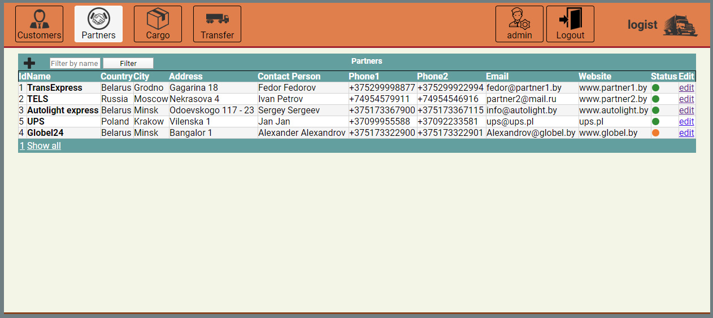

# Logist

Test task for logistic company. It contains main elements of logistics chain: Customer, Partner, Cargo and Transfer.
Two roles are implemented: Admin and User. Administrator can create new users in database.

### Used technologies
- Spring MVC
- Spring security
- Spring orm
- Hibernate
- MySQL
- JUnit
- SLF4J
- JSP + JSTL

